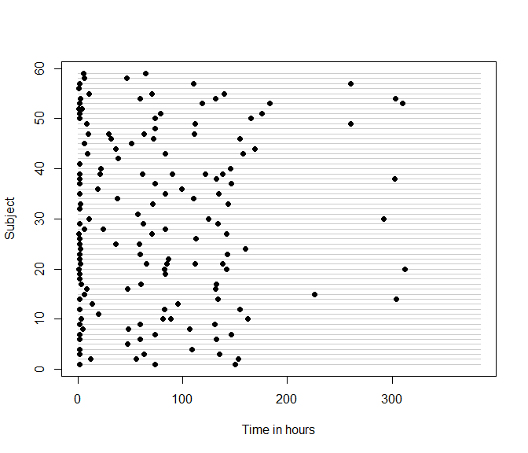

<!-- README.md is generated from README.Rmd. Please edit that file -->

# IrregLong

<!-- badges: start -->

[](https://CRAN.R-project.org/package=IrregLong)
[](https://github.com/epullenayegum/IrregLong/actions/workflows/R-CMD-check.yaml)
<!-- badges: end -->

The goal of the IrregLong package is to provide functions for handling
longitudinal data subject to irregular observation.

## Why might you need this package?

If you have longitudinal data where the assessment times vary among
subjects, you need to ask why they vary, whether time assessment times
are associated with your outcome, and what the appropriate method of
analysis is.

For example, suppose you were estimating the rate of growth among
newborns and had data collected as part of usual care. Typically, weight
and length are measured at every clinical encounter, which would include
birth and 2-month vaccinations. However, newborns who are slow to regain
their birthweight will be seen more frequently. Consequently,
observations corresponding to newborns who are growing slowly are
over-represented in your data, which will lead to under-estimation of
the rate of growth unless you account for the informative nature of the
visit process.

The IrregLong package will help you assess how irregular the assessment
times are, whether there are measured predictors of assessment times,
and to analyse your data accounting for irregularity.

## Installation

You can install the development version of IrregLong through Github:

``` r
devtools::install_github("epullenayegum/Irreglong")
```

## Examining the extent of irregularity

Before fitting any models, it is wise to examine the extent of
irregularity in the data. In many cases, a sensible question is \`\`How
closely does this data resemble repeated measures data?’’ A quick visual
way of answering this question is through an abacus plot:

``` r
abacus.plot(n=59,time="time",id="Subject",data=data,tmin=0,tmax=16*24,
 xlab.abacus="Time in hours",pch=16,col.abacus=gray(0.8))
```



## Is the irregularity informative?

If you decide that the extent of irregularity is sufficient to warrant
considering the irregularity in your analysis, the next question to
consider is whether the irregularity is informative. Irregularity that
is purely random (termed “Assessment Completely at Random”, or ACAR)
does not need to be accounted for, whereas irregularity that is
associated with the outcome of interest should be considered in the
analysis. Irregularity that results in an assessment process that is
conditionally independent of the outcome at any given time conditionally
on previously observed data (termed “Assessment at Random”, or AAR) can
be handled through inverse-intensity weighting. Irregularity that
results in an assessment process that is dependent on the outcome at any
given time (termed “Assessment Not at Random”, or ANAR) is best handled
through sensitivity analysis, for which methods are currently being
developed. Specific cases of ANAR, when assessment and outcome processes
are conditionally independent given random effects, can be handled
through semi-parametric joint models.

Given specific assumptions about the possible nature of AAR, it is
possible to examine whether there is evidence against ACAR. Most
commonly, an analyst specifies a proportional intensity model for the
assessment times given previously observed covariates; intensity rate
ratios that differ from 1 provide evidence against ACAR. The function
iiw.weights can help you model the assessment intensity, assuming a
proportional rates model. The example below uses data from the Phenobarb
dataset in the MEMSS package and shows that serum concentration of
phenobarbital at the last assessment is associated with subsequent
assessment intensity, suggesting that the ACAR assumption is not
tenable.

``` r
i <- iiw.weights(Surv(time.lag,time,event)~I(conc.lag>0 & conc.lag<=20) + 
                I(conc.lag>20 & conc.lag<=30) + I(conc.lag>30) + 
      cluster(Subject),id="Subject",time="time",event="event",data=data,
      invariant=c("Subject","Wt"),lagvars=c("time","conc"),maxfu=16*24,lagfirst=c(0,0),first=FALSE)
i$m
#> Call:
#> coxph(formula = Surv(time.lag, time, event) ~ I(conc.lag > 0 & 
#>     conc.lag <= 20) + I(conc.lag > 20 & conc.lag <= 30) + I(conc.lag > 
#>     30), data = datacox, cluster = Subject)
#> 
#>                                           coef exp(coef) se(coef) robust se
#> I(conc.lag > 0 & conc.lag <= 20)TRUE  -2.27453   0.10284  0.33148   0.40497
#> I(conc.lag > 20 & conc.lag <= 30)TRUE -2.67331   0.06902  0.33681   0.37398
#> I(conc.lag > 30)TRUE                  -2.99982   0.04980  0.42794   0.46762
#>                                            z        p
#> I(conc.lag > 0 & conc.lag <= 20)TRUE  -5.617 1.95e-08
#> I(conc.lag > 20 & conc.lag <= 30)TRUE -7.148 8.79e-13
#> I(conc.lag > 30)TRUE                  -6.415 1.41e-10
#> 
#> Likelihood ratio test=69.47  on 3 df, p=5.542e-15
#> n= 213, number of events= 154
```

## Accounting for irregularity when assuming Assessment At Random

Inverse-intensity weighted GEEs are a popular way to account for AAR.
These can be fitted using the iiwgee function

``` r
iiwgee <- iiwgee(conc ~ time + I(time^3) + log(time),Surv(time.lag,time,event)~I(conc.lag>0 & conc.lag<=20) + 
                I(conc.lag>20 & conc.lag<=30) + I(conc.lag>30) +cluster(id),
        formulanull=NULL,id="id",time="time",event="event",data=data,
        invariant=c("id","Wt"),lagvars=c("time","conc"),maxfu=16*24,lagfirst=c(0,0),first=FALSE)
summary(iiwgee$geefit)
#> 
#> Call:
#> geeglm(formula = formulagee, family = family, data = data, weights = useweight, 
#>     id = iddup, corstr = "independence")
#> 
#>  Coefficients:
#>               Estimate    Std.err    Wald Pr(>|W|)    
#> (Intercept)  1.912e+01  1.268e+00 227.512  < 2e-16 ***
#> time         1.060e-01  2.571e-02  16.988 3.76e-05 ***
#> I(time^3)   -1.469e-06  2.079e-07  49.917 1.60e-12 ***
#> log(time)    7.501e-01  7.583e-01   0.978    0.323    
#> ---
#> Signif. codes:  0 '***' 0.001 '**' 0.01 '*' 0.05 '.' 0.1 ' ' 1
#> 
#> Correlation structure = independence 
#> Estimated Scale Parameters:
#> 
#>             Estimate Std.err
#> (Intercept)    57.87   27.08
#> Number of clusters:   59  Maximum cluster size: 6
```

## Alternative approaches

Multiple outputation is similar to weighting; in each “outputted”
dataset observations are selected with probability inversely
proportional to the observation intensity. Multiple outputation is thus
particularly useful when you want to implement an analytic model that
does not permit weighting (for example, a GLMM). The package include the
functions outputation and mo for implementing multiple outputation.

If you want to assume the specific case of ANAR that arises when
assessment and outcome processes are conditionally independent given
random effects, semi-parametric joint models can be used. The IrregLong
package includes a function for fitting the Liang semi-parametric joint
model.
