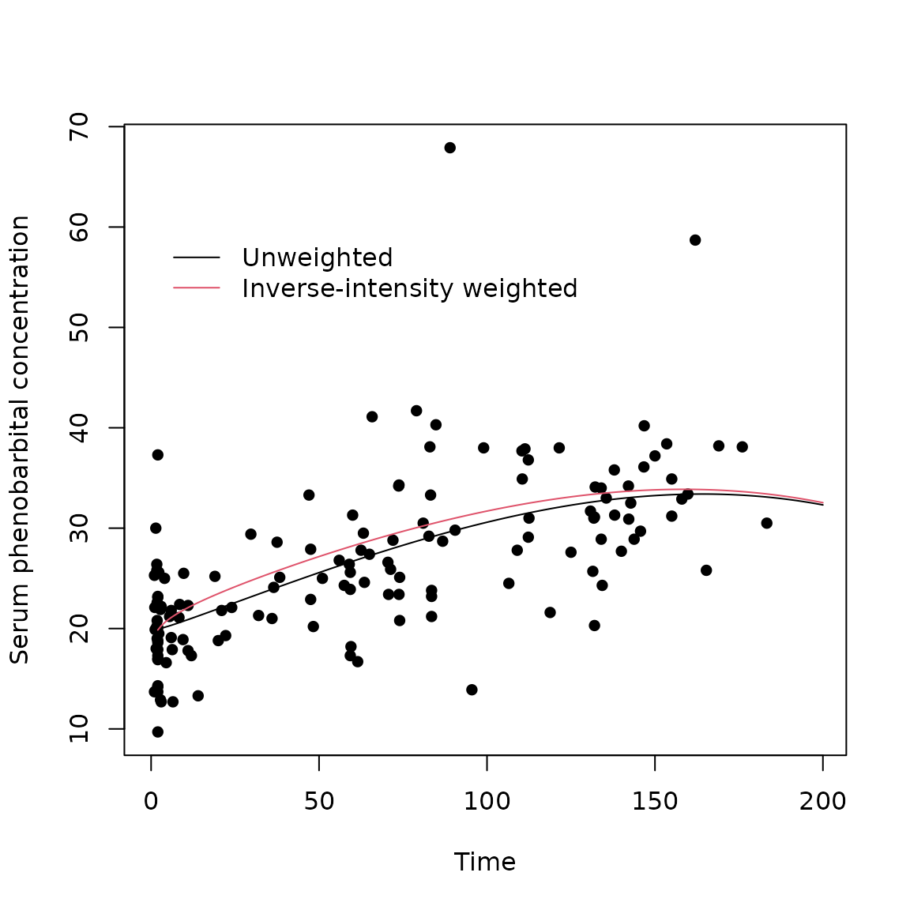

# Analysis of longitudinal data with irregular observation times

### Overview

Longitudinal data often has follow-up times that are irregular and
potentially related to outcomes. For example, in a clinic-based cohort
study where all follow-up is part of usual care, patients may visit more
often when unwell. This risks over-estimating the burden of disease
unless data are analysed appropriately. For example, in a study of HIV
positive mothers, Buzkova et al Buzkova, Brown, and John-Stewart (2010)
found a two-fold over-estimation of the estimated prevalence of
pneumonia when analysis ignored the fact that women were more likely to
visit between scheduled visits when they were unwell.

There are two categories of methods available for analysing this type of
data: methods based on inverse-intensity weighting, and methods based on
semi-parametric joint models (see Pullenayegum and Lim (2016) for an
overview). This package provides methods for inverse-intensity
weighting.

Inverse-intensity weighting weights data by the reciprocal of the
intensity (or, equivalently, the hazard) of the visit process.
Inverse-intensity weighting works in a similar way to survey weighting:
observations with a higher intensity are over-represented in the data,
and hence should receive less weight. Conversely, observations with
lower intensity are under-represented in the data, and hence receive
more weight. Lin, Scharfstein, and Rosenheck (2004) show that
inverse-intensity weighting followed by a marginal analysis with a
generalized estimating equation (GEE) results in unbiased estimation,
subject to the assumptions set out below. This package contains
functions to compute inverse-intensity weights, and also to fit
inverse-intensity weighted GEEs.

Sometimes inference may be desired for a model for which weighting is
not straightforward, for example a generalized linear mixed model or a
latent class mixed model. In these cases, multiple outputation is a
useful alternative to inverse-intensity weighting.

Multiple outputation works by discarding (outputting) excess data
(Hoffman, Sen, and Weinberg 2001; Follmann, Proschan, and Leifer 2003).
Visits are randomly deleted from the dataset with probability inversely
proportional to the visit intensity (Pullenayegum 2016). The resulting
thinned visit process is independent of the outcome process (subject to
the assumptions below), and can hence be analysed using standard
methods. To avoid wasting data, the random deletion is repeated multiple
times and the results from each analysis combined. Conceptually,
multiple outputation is the opposite of multiple imputation: where
multiple imputation imputes missing observations multiple times,
multiple outputation discards excess observations multiple times. This
package contains functions to create outputted datasets, as well as to
combine results across multiple outputations.

### Review of Inverse-intensity weighted GEEs

Suppose \\Y_i(t)\\ is the outcome of interest for subject \\i\\ at time
\\t\\, let \\X_i(t)\\ be a possibly time-dependent covariate, and
suppose interest is in the marginal model
\\E(Y_i(t)\|X_i(t))=X_i(t)\beta.\\ Moreover, suppose that we observe
\\Y_i\\ only at times \\T\_{i1},T\_{i2},\ldots, T\_{in_i}\\. Let
\\N_i(t)\\ be the counting process for the visit times, that is
\\N_i(t)=\sum\_{j}I(T\_{ij}\leq t)\\, where \\I()\\ is an indicator
function. Suppose moreover that there is a vector of observed covariates
\\Z_i(t)\\ such that \\\lim\_{\delta \downarrow 0}
\frac{E(N(t)-N(t-\delta))\|Y_i(t),Z_i(t))}{\delta}=\frac{E(N(t)-N(t-\delta))\|Z_i(t))}{\delta}=\lambda(t;Z_i(t))\\
for some hazard function \\\lambda\\. If this assumption is not met,
alternative methods of analysis should be considered
(e.g. semi-parametric joint models).

The usual GEE equations will result in biased estimates of \\\beta\\
since \\E(\sum_i\int_0^\tau X_i^\prime (Y_i(t) - X_i(t)\beta)dN_i(t))
=E(\sum_i\int_0^\tau X_i^\prime E((Y_i(t) - X_i(t)\beta)dN_i(t)\mid
X_i(t)) \neq 0 \\ Provided that the conditional independence assumption
holds, consistent estimates of \\\beta\\ may be obtained by weighting
the GEE equations by \\sw_i(t)=s_0(t)/\lambda_i(t)\\
\\E(\sum_i\int_0^\tau X_i^\prime sw_i(t)(Y_i(t) - X_i(t)\beta)dN_i(t))
=E(\sum_i\int_0^\tau X_i^\prime E(sw_i(t)(Y_i(t) -
X_i(t)\beta)dN_i(t)\mid X_i(t),Y_i(t)) \\ = E(\sum_i\int_0^\tau
X_i^\prime sw_i(t)(Y_i(t) - X_i(t)\beta)\lambda_i(t)dt=0. \\

### Implementing Inverse-Intensity weighting

The first step in inverse-intensity weighting is to calculate the
weights, usually by fitting a proportional hazards model to the
recurrent event process formed by the visit times. That is, one fits the
model \\\lambda(t;Z_i(t))=\lambda_0(t)\exp(Z_i(t)\gamma).\\ This can be
done using the coxph function, however the data usually requires some
pre-processing. Firstly, the counting process formulation takes the form
Surv(start.time,stop.time,event) and so typically requires the time
variable to be lagged. Time-varying covariates will often need to be
lagged as well. Secondly, if follow-up was stopped at a time later than
the last visit, then additional rows capturing the censoring time must
be added to the dataset. For example, if follow-up is stopped after two
years, and an individual’s last visit is at 1.5 years, then we must
include the information that there was no visit between 1.5 years and
two years when estimating the visit intensity model. Using the data on
just the observed visits ignores this.

The IrregLong package simplifies modelling of the visit process by
creating a dataset with lagged variables (specified using lagvars=) and
time intervals corresponding to censoring times (specified using
maxfu=).

The inverse-intensity weight is \\w_i(t) =
\frac{\exp(-Z_i(t)\gamma)}{\lambda_0(t)}\\. Following Buzkova and Lumley
(2007), all inverse-intensity weights in this package are stabilized by
the baseline hazard \\\lambda_0(t)\\, so that the stabilized weight is
\\sw_i(t)=\exp(-Z_i(t)\gamma)\\. In some settings one may additionally
wish to stabilize by a function of the time-invariant covariates in
\\X_i(t)\\, and an option to do so is included in the functions. One can
then fit a GEE to obtain the regression coefficients \\\beta\\
corresponding to regressing \\Y_i(t)\\ on \\X_i(t)\\, weighting by
\\sw_i(t)\\.

An important practical point is that when using inverse-intensity
weighting the working variance for the GEE must be set to the identity.
This is because functions for fitting GEEs interpret the weights as
indicating heteroscedasticity. Thus if \\Y_i\\ is the vector of
observations for subject \\i\\, \\X_i\\ is the matrix of corresponding
covariates, \\R_i\\ is the working variance matrix and \\D_i\\ is a
diagonal matrix whose \\jj\\ entry of the weight for the \\j^{th}\\
observation for subject \\i\\, then standard GEE software solves
\\\sum_iX_i^\prime D_i^{1/2}R_i^{-1}D_i^{1/2}(Y_i-X_i\beta)=0,\\ whereas
we wish to solve \\\sum_iX_i^\prime R_i^{-1}D_i(Y_i-X_i\beta)=0.\\ The
two are, however, identical if \\R_i\\ is the identity matrix. While at
first glance it may seem appealing to create a GEE estimation function
that implements the weights as desired so as to allow for non-diagonal
working variance matrices, note that the working variance should then be
the variance of \\D_i(Y_i-X_i\beta)\\ rather than \\(Y_i-X_i\beta)\\.
Since the weights usually involve time-dependent covariates that are
often internal, the standard correlation structures (exchangeable,
autoregressive) become less plausible.

#### Example

These methods are illustrated using the Phenobarb dataset from the MEMSS
package. Routine clinical pharmacokinetic data were collected from 59
preterm infants who received phenobarbital in order to prevent seizures.
Blood draws were taken to determine serum concentration of
phenobarbital, with the timing and number of draws varying among
infants. For the purposes of illustration this analysis focuses not on
pharmacokinetics but on the mean serum concentration of phenobarbital
over time.

This dataset contains some rows corresponding to times at which
phenobarbital given and others at which a blood draw was taken to
determine serum phenobarbital concentration. For the visit intensity
model, the event of interest is having a concentration measured, so we
set the variable event=1 if concentration was measured and zero
otherwise. The data is then restricted to those time points when a
concentration measurement was taken. The original pharmacokinetic
analysis restricts attention to the first 16 days of life, which we also
do here.

``` r
library(IrregLong)
library(nlme)
library(survival)
library(geepack)
library(data.table)
```

``` r
data(Phenobarb)
Phenobarb$event <- 1-as.numeric(is.na(Phenobarb$conc))
data <- Phenobarb
data <- data[data$event==1,]
data$id <- as.numeric(data$Subject)
data <- data[data$time<16*24,]
data <- data[order(data$id,data$time),]
head(data)
```

    ## Grouped Data: conc ~ time | Subject
    ##     Subject  Wt Apgar ApgarInd  time dose conc event id
    ## 544      42 2.8     9     >= 5  14.0   NA 13.3     1  1
    ## 551      42 2.8     9     >= 5  95.5   NA 13.9     1  1
    ## 400      28 3.2     9     >= 5   2.0   NA 16.9     1  2
    ## 408      30 1.8     8     >= 5   6.3   NA 17.9     1  3
    ## 420      30 1.8     8     >= 5 226.3   NA 16.5     1  3
    ## 701      56 0.6     4      < 5  20.0   NA 18.8     1  4

It can be helpful to begin by exploring the extent of visit
irregularity. We begin with some simple summary statistics of the number
of events per Subject, then plot times of measurement for each subjects.

``` r
summary(tapply(data$event,data$Subject,sum))
```

    ##    Min. 1st Qu.  Median    Mean 3rd Qu.    Max. 
    ##    1.00    2.00    3.00    2.61    3.00    6.00

``` r
abacus.plot(n=59,time="time",id="Subject",data=data,tmin=0,tmax=16*24,
 xlab.abacus="Time in hours",pch=16,col.abacus=gray(0.8))
```


This shows an median of 3 visits per subject with a range of 1 to 6. The
plot shows that after an initial measurement shortly after birth,
observations times vary among subjects.

The extent of irregularity can be further explored through a visit
frequency plot. This plot is derived by dividing the time interval of
interest into sets of bins with bin widths becoming increasingly wider
across sets. For each set of bins, the mean proportion of individuals
with 0, 1 or \>1 visit per bin is calculated. This is then plotted
against either the number of bins or some other measure of bin width.
When the study protocol does not specify recommended visit times, sets
of bins can be defined either as intervals of equal widths (with
different numbers of bins in each set), or as intervals for which the
expected number of visits per bin is constant across bins (again, with
varying numbers of bins in each set). The expected number of visits in a
bin is simply the area under the cumulative hazard for that bin. The
visit frequency plot shows that the mean proportion of individuals with
1 visit per bin is highest at 0.5 with 3 bins, and is clearly not
consistent with repeated measures. Finally, the area under the curve
(AUC) when the proportion of subjects with \\\>1\\ visits per bin is
plotted against the proportion of subjects with \\0\\ visits per bin can
be used as a numeric summary of the extent of irregularity. For perfect
repeated measures, the AUC is 0; for a Poisson process, the AUC is 0.25.
A log transformed version of the AUC is also available; for this version
perfect repeated measures has a value of zero while a Poisson process
has an AUC of 100. The AUC in this example is 0.18, with a transformed
value of 64, demonstrating a high degree of irregularity.

``` r
 counts <- extent.of.irregularity(data,time="time",id="id",
   scheduledtimes=NULL, cutpoints=NULL,ncutpts=50, 
   maxfu=16*24, plot=TRUE,legendx=30,legendy=0.8,
  formula=Surv(time.lag,time,event)~1,tau=16*24)
```


``` r
counts$auc
```

    ## [1] 0.1814126

``` r
counts$transformed.auc
```

    ## [1] 65.02388

To fit an inverse intensity weighted GEE, one begins by modelling the
visit intensity. Although the IrregLong package includes a function that
calculates both the inverse-intensity weights and the weighted GEE in a
single command, it can be helpful to start by focussing on the visit
intensity model. Modelling is usually done through a Cox proportional
hazards model on the recurrent visit process. To do this, we need to
specify time periods at risk, and so need to lag the time variable. If
there are time-dependent covariates and we suspect that the value at the
last measurement is predictive of when the next measurement will be
taken, these time-dependent covariates must also be lagged. The
IrregLong package simplifies this process by allowing the user to
specify which covariates should be lagged (lagvars=c(“time”,“conc”)) and
creating these lagged covariates internally (time.lag,conc.lag). The
value of the lagged variables will by default be missing for the first
observation in each subject, but this can be changed through the
lagfirst argument. We set the lagged value of time at the first observed
blood draw to be zero (lagfirst=0) since observation started at birth
for all infants. Similarly, we set the lagged value of serum
phenobarbital concentration to be zero at the first draw, since the last
known value of serum concentration was at birth, prior to administration
of phenobarbital, and allow for a non-linear relationship between
concentration and log visit intensity.

``` r
data$Apgar <- as.numeric(data$Apgar)
i <- iiw.weights(Surv(time.lag,time,event)~Wt + Apgar + 
                   I(conc.lag>0 & conc.lag<=20) + 
                I(conc.lag>20 & conc.lag<=30) + I(conc.lag>30)+
      cluster(Subject),id="Subject",time="time",event="event",data=data,
      invariant=c("Subject","Wt","Apgar"),lagvars=c("time","conc"),maxfu=16*24,
      lagfirst=c(0,0),first=FALSE)
i$m
```

    ## Call:
    ## coxph(formula = Surv(time.lag, time, event) ~ Wt + Apgar + I(conc.lag > 
    ##     0 & conc.lag <= 20) + I(conc.lag > 20 & conc.lag <= 30) + 
    ##     I(conc.lag > 30), data = datacox, cluster = Subject)
    ## 
    ##                                            coef exp(coef)  se(coef) robust se
    ## Wt                                    -0.133775  0.874787  0.126385  0.117649
    ## Apgar                                 -0.002765  0.997239  0.039417  0.045185
    ## I(conc.lag > 0 & conc.lag <= 20)TRUE  -2.264475  0.103885  0.330413  0.403114
    ## I(conc.lag > 20 & conc.lag <= 30)TRUE -2.664957  0.069602  0.334704  0.375708
    ## I(conc.lag > 30)TRUE                  -2.993505  0.050111  0.428129  0.467288
    ##                                            z        p
    ## Wt                                    -1.137    0.256
    ## Apgar                                 -0.061    0.951
    ## I(conc.lag > 0 & conc.lag <= 20)TRUE  -5.617 1.94e-08
    ## I(conc.lag > 20 & conc.lag <= 30)TRUE -7.093 1.31e-12
    ## I(conc.lag > 30)TRUE                  -6.406 1.49e-10
    ## 
    ## Likelihood ratio test=70.86  on 5 df, p=6.777e-14
    ## n= 213, number of events= 154

Since Apgar score and birthweight are not significant, we consider
whether the model can be simplified - first by including Apgar score as
an indicator (\\\geq 5\\ vs. \\\<5\\), then by removing variables that
are not significant.

``` r
i <- iiw.weights(Surv(time.lag,time,event)~Wt + ApgarInd + I(conc.lag>0 & conc.lag<=20) + 
                I(conc.lag>20 & conc.lag<=30) + I(conc.lag>30)+ 
      cluster(Subject),id="Subject",time="time",event="event",data=data,
      invariant=c("Subject","Wt","ApgarInd"),lagvars=c("time","conc"), maxfu=16*24,lagfirst=c(0,0),first=FALSE)
i$m
```

    ## Call:
    ## coxph(formula = Surv(time.lag, time, event) ~ Wt + ApgarInd + 
    ##     I(conc.lag > 0 & conc.lag <= 20) + I(conc.lag > 20 & conc.lag <= 
    ##     30) + I(conc.lag > 30), data = datacox, cluster = Subject)
    ## 
    ##                                           coef exp(coef) se(coef) robust se
    ## Wt                                    -0.16625   0.84683  0.12404   0.12749
    ## ApgarInd>= 5                           0.29125   1.33810  0.22949   0.34827
    ## I(conc.lag > 0 & conc.lag <= 20)TRUE  -2.35868   0.09455  0.34240   0.37226
    ## I(conc.lag > 20 & conc.lag <= 30)TRUE -2.75127   0.06385  0.34814   0.32775
    ## I(conc.lag > 30)TRUE                  -3.11277   0.04448  0.44268   0.44155
    ##                                            z        p
    ## Wt                                    -1.304    0.192
    ## ApgarInd>= 5                           0.836    0.403
    ## I(conc.lag > 0 & conc.lag <= 20)TRUE  -6.336 2.36e-10
    ## I(conc.lag > 20 & conc.lag <= 30)TRUE -8.395  < 2e-16
    ## I(conc.lag > 30)TRUE                  -7.050 1.79e-12
    ## 
    ## Likelihood ratio test=72.57  on 5 df, p=2.994e-14
    ## n= 213, number of events= 154

``` r
i <- iiw.weights(Surv(time.lag,time,event)~Wt + I(conc.lag>0 & conc.lag<=20) + 
                I(conc.lag>20 & conc.lag<=30) + I(conc.lag>30)+ 
      cluster(Subject),id="Subject",time="time",event="event",data=data,
      invariant=c("Subject","Wt"),lagvars=c("time","conc"),maxfu=16*24,lagfirst=c(0,0),first=FALSE)
i$m
```

    ## Call:
    ## coxph(formula = Surv(time.lag, time, event) ~ Wt + I(conc.lag > 
    ##     0 & conc.lag <= 20) + I(conc.lag > 20 & conc.lag <= 30) + 
    ##     I(conc.lag > 30), data = datacox, cluster = Subject)
    ## 
    ##                                           coef exp(coef) se(coef) robust se
    ## Wt                                    -0.13679   0.87215  0.11897   0.11778
    ## I(conc.lag > 0 & conc.lag <= 20)TRUE  -2.26719   0.10360  0.32831   0.40747
    ## I(conc.lag > 20 & conc.lag <= 30)TRUE -2.66595   0.06953  0.33457   0.37910
    ## I(conc.lag > 30)TRUE                  -2.99587   0.04999  0.42698   0.47295
    ##                                            z        p
    ## Wt                                    -1.161    0.245
    ## I(conc.lag > 0 & conc.lag <= 20)TRUE  -5.564 2.63e-08
    ## I(conc.lag > 20 & conc.lag <= 30)TRUE -7.032 2.03e-12
    ## I(conc.lag > 30)TRUE                  -6.334 2.38e-10
    ## 
    ## Likelihood ratio test=70.86  on 4 df, p=1.496e-14
    ## n= 213, number of events= 154

``` r
i <- iiw.weights(Surv(time.lag,time,event)~I(conc.lag>0 & conc.lag<=20) + 
                I(conc.lag>20 & conc.lag<=30) + I(conc.lag>30) + 
      cluster(Subject),id="Subject",time="time",event="event",data=data,
      invariant=c("Subject","Wt"),lagvars=c("time","conc"),maxfu=16*24,lagfirst=c(0,0),first=FALSE)
i$m
```

    ## Call:
    ## coxph(formula = Surv(time.lag, time, event) ~ I(conc.lag > 0 & 
    ##     conc.lag <= 20) + I(conc.lag > 20 & conc.lag <= 30) + I(conc.lag > 
    ##     30), data = datacox, cluster = Subject)
    ## 
    ##                                           coef exp(coef) se(coef) robust se
    ## I(conc.lag > 0 & conc.lag <= 20)TRUE  -2.27453   0.10284  0.33148   0.40497
    ## I(conc.lag > 20 & conc.lag <= 30)TRUE -2.67331   0.06902  0.33681   0.37398
    ## I(conc.lag > 30)TRUE                  -2.99982   0.04980  0.42794   0.46762
    ##                                            z        p
    ## I(conc.lag > 0 & conc.lag <= 20)TRUE  -5.617 1.95e-08
    ## I(conc.lag > 20 & conc.lag <= 30)TRUE -7.148 8.79e-13
    ## I(conc.lag > 30)TRUE                  -6.415 1.41e-10
    ## 
    ## Likelihood ratio test=69.47  on 3 df, p=5.542e-15
    ## n= 213, number of events= 154

It thus appears that last concentration is predictive of the time to the
next concentration measurement.

Having established a model for the visit intensity, we now turn to
modelling the serum concentration as a function of time. A plot of
concentration over time shows that the relationship is unlikely to be
linear, even in the weighted data. We thus use fractional polynomials to
model the shape of the association over time.

``` r
plot(data$time,data$conc,xlim=c(0,200),pch=16, xlab="Time in hours", ylab="Concentration")
```


Fractional polynomials consider powers of -2, -1, -0.5, 0.5, 1, 2, 3,
and a log-transform, and use the best-fitting from among these. Since
weighting tends not to lead to dramatic changes in the shape of the
relationship between outcome and covariates, we use the unweighted data
to choose the functional form of time, and use the adjusted R-squared as
a measure of goodness of fit.

``` r
rsq1 <- array(dim=8)
rsq1[1] <- summary(lm(conc~time,data=data))$adj.r.squared
rsq1[2] <- summary(lm(conc~I((time)^0.5),data=data))$adj.r.squared
rsq1[3] <- summary(lm(conc~I((time)^2),data=data))$adj.r.squared
rsq1[4] <- summary(lm(conc~I((time)^3),data=data))$adj.r.squared
rsq1[5] <- summary(lm(conc~log(time),data=data))$adj.r.squared
rsq1[6] <- summary(lm(conc~I((time)^(-0.5)),data=data))$adj.r.squared
rsq1[7] <- summary(lm(conc~I((time)^(-1)),data=data))$adj.r.squared
rsq1[8] <- summary(lm(conc~I((time)^(-2)),data=data))$adj.r.squared
which.max(rsq1)
```

    ## [1] 5

``` r
rsq1[which.max(rsq1)]
```

    ## [1] 0.1952896

Based on this, we choose the log transform of time, and now-consider
whether a second order fractional polynomial would improve the fit. This
involves adding, in turn, each of the powers previously considered, as
well as \\time\times\log(time)\\.

``` r
rsq2 <- array(dim=8)
rsq2[1] <- summary(lm(conc~log(time)+ time,data=data))$adj.r.squared
rsq2[2] <- summary(lm(conc~log(time)+ I((time)^0.5),data=data))$adj.r.squared
rsq2[3] <- summary(lm(conc~log(time) + I((time)^2),data=data))$adj.r.squared
rsq2[4] <- summary(lm(conc~log(time)+ I((time)^3),data=data))$adj.r.squared
rsq2[5] <- summary(lm(conc~log(time)+ time:log(time),data=data))$adj.r.squared
rsq2[6] <- summary(lm(conc~log(time) + I((time)^(-0.5))*log(1+time),data=data))$adj.r.squared
rsq2[7] <- summary(lm(conc~log(time) + I((time)^(-1)),data=data))$adj.r.squared
rsq2[8] <- summary(lm(conc~log(time)+ I((time)^(-2)),data=data))$adj.r.squared
which.max(rsq2)
```

    ## [1] 4

``` r
rsq2[which.max(rsq2)]
```

    ## [1] 0.3468345

We thus use time^3 and log(time) to describe concentration over time. We
also check for the best functional form in the weighted data:

``` r
rsq1 <- array(dim=8)
rsq1[1] <- summary(lm(conc~time,data=data,weight=i$iiw.weight))$adj.r.squared
rsq1[2] <- summary(lm(conc~I((time)^0.5),data=data,weight=i$iiw.weight))$adj.r.squared
rsq1[3] <- summary(lm(conc~I((time)^2),data=data,weight=i$iiw.weight))$adj.r.squared
rsq1[4] <- summary(lm(conc~I((time)^3),data=data,weight=i$iiw.weight))$adj.r.squared
rsq1[5] <- summary(lm(conc~log(time),data=data,weight=i$iiw.weight))$adj.r.squared
rsq1[6] <- summary(lm(conc~I((time)^(-0.5)),data=data,weight=i$iiw.weight))$adj.r.squared
rsq1[7] <- summary(lm(conc~I((time)^(-1)),data=data,weight=i$iiw.weight))$adj.r.squared
rsq1[8] <- summary(lm(conc~I((time)^(-2)),data=data,weight=i$iiw.weight))$adj.r.squared
which.max(rsq1)
```

    ## [1] 4

``` r
rsq1[which.max(rsq1)]
```

    ## [1] 0.163227

``` r
rsq1 <- array(dim=8)
rsq1[1] <- summary(lm(conc~I((time)^3) +time,data=data,weight=i$iiw.weight))$adj.r.squared
rsq1[2] <- summary(lm(conc~I((time)^3) +I((time)^0.5),data=data,weight=i$iiw.weight))$adj.r.squared
rsq1[3] <- summary(lm(conc~I((time)^3) +I((time)^2),data=data,weight=i$iiw.weight))$adj.r.squared
rsq1[4] <- summary(lm(conc~I((time)^3) + log(time):I(time^3),data=data,weight=i$iiw.weight))$adj.r.squared
rsq1[5] <- summary(lm(conc~I((time)^3) +log(time),data=data,weight=i$iiw.weight))$adj.r.squared
rsq1[6] <- summary(lm(conc~I((time)^3) +I((time)^(-0.5)),data=data,weight=i$iiw.weight))$adj.r.squared
rsq1[7] <- summary(lm(conc~I((time)^3) +I((time)^(-1)),data=data,weight=i$iiw.weight))$adj.r.squared
rsq1[8] <- summary(lm(conc~I((time)^3) +I((time)^(-2)),data=data,weight=i$iiw.weight))$adj.r.squared
which.max(rsq1)
```

    ## [1] 1

``` r
rsq1[which.max(rsq1)]
```

    ## [1] 0.3353907

In all models, we thus use time, time^3, and log(time). The
inverse-intensity-weighted GEE can be fitted using the function iiwgee.
This function specifies first the formula for the GEE, then the formula
for the inverse intensity weights.

``` r
data$logtime <- log(data$time)
data$time3 <- (data$time^3)/(mean(data$time^3))
iiwgee <- iiwgee(conc ~ time + time3 + logtime,Surv(time.lag,time,event)~I(conc.lag>0 & conc.lag<=20) + 
                I(conc.lag>20 & conc.lag<=30) + I(conc.lag>30) +cluster(id),
        formulanull=NULL,id="id",time="time",event="event",data=data,
        invariant=c("id","Wt"),lagvars=c("time","conc"),maxfu=16*24,lagfirst=c(0,0),first=FALSE)
```

Note that the iiwgee function does not include an option for the working
variance. As discussed above, when working with inverse-intensity
weights, the working variance should always be the identity. The iiwgee
function returns the inverse-intensity weighted GEE fit:

``` r
summary(iiwgee$geefit)
```

    ## 
    ## Call:
    ## geeglm(formula = formulagee, family = family, data = data, weights = useweight, 
    ##     id = iddup, corstr = "independence")
    ## 
    ##  Coefficients:
    ##             Estimate  Std.err    Wald Pr(>|W|)    
    ## (Intercept) 19.12361  1.26785 227.512  < 2e-16 ***
    ## time         0.10595  0.02571  16.988 3.76e-05 ***
    ## time3       -3.32748  0.47097  49.917 1.60e-12 ***
    ## logtime      0.75007  0.75829   0.978    0.323    
    ## ---
    ## Signif. codes:  0 '***' 0.001 '**' 0.01 '*' 0.05 '.' 0.1 ' ' 1
    ## 
    ## Correlation structure = independence 
    ## Estimated Scale Parameters:
    ## 
    ##             Estimate Std.err
    ## (Intercept)    57.87   27.08
    ## Number of clusters:   59  Maximum cluster size: 6

For comparison, we also fit the unweighted GEE, and plot the two serum
concentration trajectories

``` r
m <- geeglm(conc ~ time + I(time^3) + log(time) , id=Subject, data=data)
time <- (2:200)
unweighted <- cbind(rep(1,199),time,time^3,log(time))%*%m$coefficients
weighted <- cbind(rep(1,199),time,time^3/mean(data$time^3),log(time))%*%iiwgee$geefit$coefficients
plot(data$time,data$conc,xlim=c(0,199),ylim=c(min(unweighted,weighted,data$conc),max(unweighted,weighted,data$conc)),pch=16,xlab="Time",ylab="Serum phenobarbital concentration")
lines(time,unweighted,type="l")
lines(time,weighted,col=2)
legend (0,60,legend=c("Unweighted","Inverse-intensity weighted"),col=1:2,bty="n",lty=1)
```



The iiwgee function also returns the fitted visit intensity model:

``` r
summary(iiwgee$phfit)
```

    ## Call:
    ## coxph(formula = Surv(time.lag, time, event) ~ I(conc.lag > 0 & 
    ##     conc.lag <= 20) + I(conc.lag > 20 & conc.lag <= 30) + I(conc.lag > 
    ##     30), data = datacox, cluster = id)
    ## 
    ##   n= 213, number of events= 154 
    ## 
    ##                                          coef exp(coef) se(coef) robust se
    ## I(conc.lag > 0 & conc.lag <= 20)TRUE  -2.2745    0.1028   0.3315    0.4050
    ## I(conc.lag > 20 & conc.lag <= 30)TRUE -2.6733    0.0690   0.3368    0.3740
    ## I(conc.lag > 30)TRUE                  -2.9998    0.0498   0.4279    0.4676
    ##                                           z Pr(>|z|)    
    ## I(conc.lag > 0 & conc.lag <= 20)TRUE  -5.62  1.9e-08 ***
    ## I(conc.lag > 20 & conc.lag <= 30)TRUE -7.15  8.8e-13 ***
    ## I(conc.lag > 30)TRUE                  -6.42  1.4e-10 ***
    ## ---
    ## Signif. codes:  0 '***' 0.001 '**' 0.01 '*' 0.05 '.' 0.1 ' ' 1
    ## 
    ##                                       exp(coef) exp(-coef) lower .95 upper .95
    ## I(conc.lag > 0 & conc.lag <= 20)TRUE     0.1028       9.72    0.0465     0.227
    ## I(conc.lag > 20 & conc.lag <= 30)TRUE    0.0690      14.49    0.0332     0.144
    ## I(conc.lag > 30)TRUE                     0.0498      20.08    0.0199     0.125
    ## 
    ## Concordance= 0.624  (se = 0.014 )
    ## Likelihood ratio test= 69.5  on 3 df,   p=6e-15
    ## Wald test            = 54.4  on 3 df,   p=9e-12
    ## Score (logrank) test = 69.1  on 3 df,   p=7e-15,   Robust = 56.1  p=4e-12
    ## 
    ##   (Note: the likelihood ratio and score tests assume independence of
    ##      observations within a cluster, the Wald and robust score tests do not).

### Multiple Outputation

Once the inverse-intensity weights have been calculated, an alternative
use for them is to perform multiple outputation. When some of the
weights are very large, this can result in very small outputted
datasets, and so it can be helpful to truncate the weights. Moreover,
the smaller sample size of each outputted dataset results in
collinearity on including all three functions of time, so for this
analysis we use time and time^3 only, as these were the best fit in the
weighted data. The code below computes 20 outputted datasets, analyses
each using an unweighted GEE, then combines the results.

``` r
library(geesmv)


reg <- function(data){
  m <- geeglm(conc~time + I(time^3), id=id,data=data)
  est <- summary(m)$coefficients[,1:2]
  if(max(table(data$id))>1) est[,2] <- GEE.var.md(conc~time + I(time^3) , id=id,data=data)$cov.beta
  est <- data.matrix(est)
  return(est)
}
set.seed(301031)
wt <- i$iiw.weight
wt[wt>quantile(i$iiw.weight,0.95)] <- quantile(i$iiw.weight,0.95)
m.mogee <- mo(20,reg,data,wt, singleobs=FALSE,id="id",time="time",keep.first=FALSE,var=TRUE)
m.mogee
```

The multiple outputation estimates of the regression coefficients
(`$est`), and is the mean across outputations of the GEE estimates. The
multiple outputation standard error (`$se`) is a function of both the
within outputation standard errors and the between outputation variance.
The relative efficiency of using 20 outputations in place of all
possible outputations is given by `RE.MO`. In this example the number of
observations per subject becomes small on outputation, resulting in the
usual sandwich variance estimator for the GEE underestimating the
standard error. For this reason, we use a small sample sandwich variance
correction from the “geesmv” package. There are a number of options
available, and in this example we have used the Mancl deRouen correction
(Mancl and DeRouen 2001). The multiple outputation estimates based on
the above seed were 16.0 (SE 1.53), -7.72e-07 (SE 1.16e-07) and 3.42 (SE
5.52) for the intercept, \\time\\, and \\time^3\\ respectively. The
relative efficiencies were 1.01, 1.008, and 1.008, suggesting that there
is little to be gained by running more outputations.

Multiple outputation is helpful for analyses where weighting is
difficult to implement. One such example is a semi-parametric joint
model. Semi-parametric joint models are useful when there are latent
variables that influence both the outcome and visit processes. We
consider the Liang (Liang, Lu, and Ying 2009) semi-parametric joint
model: \\Y_i(t)=\beta_0(t) + X_i(t)\beta + W_i(t)\nu\_{i1} +
\epsilon_i(t) \\ \\\lambda_i(t)=\nu\_{i2}\lambda_0(t)\exp(U_i\gamma) \\
where \\W_i(t)\\ is a subset of the covariates \\X_i(t)\\, \\U_i\\ is a
vector of baseline covariates, \\\epsilon_i(t)\\ is a mean-zero random
error, and \\\nu\_{i1}\\, \\\nu\_{i2}\\ are (potentially correlated)
random effects.

The Liang model requires that the covariates in the model for the visits
be time invariant. In practice,
\\\lambda_i(t)=\nu\_{i2}\lambda_0(t)\exp(Z_i(t)\gamma), \\ for an
observed vector of time-dependent auxiliary covariates \\Z_i(t)\\ may be
more reasonable. Multiple outputation makes inference under this model
possible by creating outputted datasets in which the visit process does
not depend on the observed covariates \\Z_i(t)\\. These datasets can be
analysed using Liang’s method for the special case where there are no
covariates in the visit process model.

#### Example

We consider the same example as before, now examining whether the
concentration differs between those with an Apgar score \<5 at birth and
those with a score \>=5, and allowing a random intercept that is
potentially correlated with a frailty variable in the visit process.
That is, we take \\conc_i(t)=\beta_0(t) + \beta_1I(Apgar_i\<5) +
\beta_2I(Apgar\geq 5)t + \beta_3I(Apgar\geq 5)t^3 + \nu\_{i1} +
\epsilon_i(t),\\ with visit process model given by
\\\lambda_i(t)=\nu\_{i2}\lambda_0(t)\exp(I(0\<conc_i(T\_{iN_i(t^-)})\leq
20)\gamma_1 + I(20\< conc_i(T\_{iN_i(t^-)})\leq 30)\gamma_2 +\\
I(conc_i(T\_{iN_i(t^-)})\> 30)\gamma_3, \\ where
\\\nu\_{i1}=(\nu\_{i11},\nu\_{i12})^\prime\\ and \\\nu\_{i2}\\ are
potentially correlated with
\\E(\nu\_{i1}\mid\nu\_{i2})=\theta(\nu\_{i2}-1)\\ for some \\\theta\\.
Note that when calculating the weights used for outputation, the
`frailty=TRUE` option should be used in visit intensity calculation
because the lagged concentration is an internal covariate that is
potentially correlated with the frailty variable, and the Cox model is
non-collapsible. For this analysis, time is transformed to days rather
than hours to avoid computational problems with the Liang function.

``` r
Liangmo <- function(data,Yname,Xnames,Wnames,maxfu,baseline){
 x <- Liang(data=data,Yname=Yname,Xnames=Xnames,Wnames=Wnames,id="id",time="time",
            maxfu=maxfu,baseline=baseline,Xfn=Xfn,Wfn=Wfn); print(x); return(x)
}
Xfn <- function(id,time){
  # Group is time invariant so just use the first value for each subject
  return(as.numeric(data$ApgarInd[data$id==id][1]))
}
Wfn <- function(id,time){
  return(c(1,time))
}
data$Intercept <- 1
data$time3 <- (data$time)^3
data$logtime <- log(data$time)
data$ApgarInd.time <- as.numeric(data$ApgarInd)*data$time/24
data$ApgarInd.time3 <- as.numeric(data$ApgarInd)*((data$time/24)^3)

set.seed(301031)
ifrailty <- iiw.weights(Surv(time.lag,time,event)~I(conc.lag>0 & conc.lag<=20) + 
                I(conc.lag>20 & conc.lag<=30) + I(conc.lag>30)   
                      +frailty(id),id="id",time="time",event="event",data=data,     
                      invariant=c("id"),lagvars=c("time","conc"),maxfu=16*24,
                      lagfirst=c(0,0), first=FALSE)

wt <- ifrailty$iiw.weight

m.moLiang <- mo(20,Liangmo,data,wt, 
         singleobs=FALSE,id="id",time="time",keep.first=FALSE,var=FALSE,Yname="conc",
         Xnames=c("ApgarInd","ApgarInd.time","ApgarInd.time3"), 
         Wnames=c("Intercept"),maxfu=16*24,baseline=0)

m.moLiang$est
```

``` r
m.moLiang$est
```

    ## [1] -19.99695   5.37236  -0.02748        NA   0.00000

The first three coefficients represent for the Apgar score, its
interaction with time, and its interaction with time^3 respectively,
while the fourth coefficient is the estimated value of \\\theta\\ and
the final entry is the estimated variance of the frailty variable in the
visit process model. Since in this case the estimated frailty is zero,
we can conclude that the Liang model is not needed.

## References

Buzkova, P., E. R. Brown, and G. C. John-Stewart. 2010. “Longitudinal
Data Analysis for Generalized Linear Models Under Participant-Driven
Informative Follow-up: An Application in Maternal Health Epidemiology.”
*American Journal of Epidemiology* 171: 189–97.

Buzkova, P., and T. Lumley. 2007. “Longitudinal Data Analysis for
Generalized Linear Models with Follow-up Dependent on Outcome-Related
Variables.” *The Canadian Journal of Statistics* 35: 485–500.

Follmann, D., M. Proschan, and E. Leifer. 2003. “Multiple Outputation:
Inference for Complex Clustered Data by Averaging Analyses from
Independent Data.” *Biometrics* 59: 420–29.

Hoffman, E. B., P. K. Sen, and C. Weinberg. 2001. “Within-Cluster
Resampling.” *Biometrika* 88: 1121–34.

Liang, Y., W. Lu, and Z. Ying. 2009. “Joint Modeling and Analysis of
Longitudinal Data with Informative Observation Times.” *Biometrics* 65:
377–84.

Lin, H., D. O. Scharfstein, and R. A. Rosenheck. 2004. “Analysis of
Longitudinal Data with Irregular, Outcome-Dependent Follow-up.” *Journal
of the Royal Statistical Society, Series B* 66: 791–813.

Mancl, LA, and TA DeRouen. 2001. “A Covariance Estimator for GEE with
Improved Small-Sample Properties.” Journal Article. *Biometrics* 57 (1):
126–34. <https://doi.org/10.1111/j.0006-341X.2001.00126.x>.

Pullenayegum, E. M. 2016. “Multiple Outputation for the Analysis of
Longitudinal Data Subject to Irregular Observation.” *Statistics in
Medicine* 35: 1800–1818.

Pullenayegum, E. M., and L. S. H. Lim. 2016. “Longitudinal Data Subject
to Irregular Observation: A Review of Methods with a Focus on Visit
Processes, Assumptions, and Study Design.” *Statistical Methods in
Medical Research* 25: 2992–3014.
